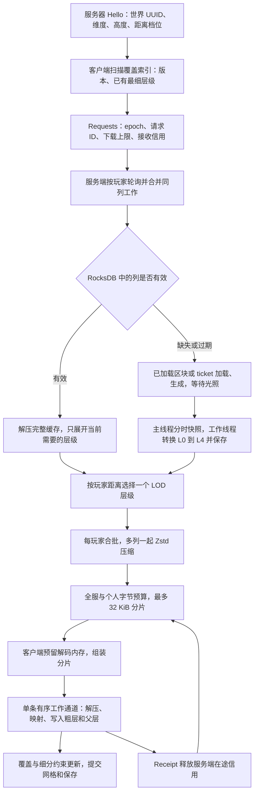
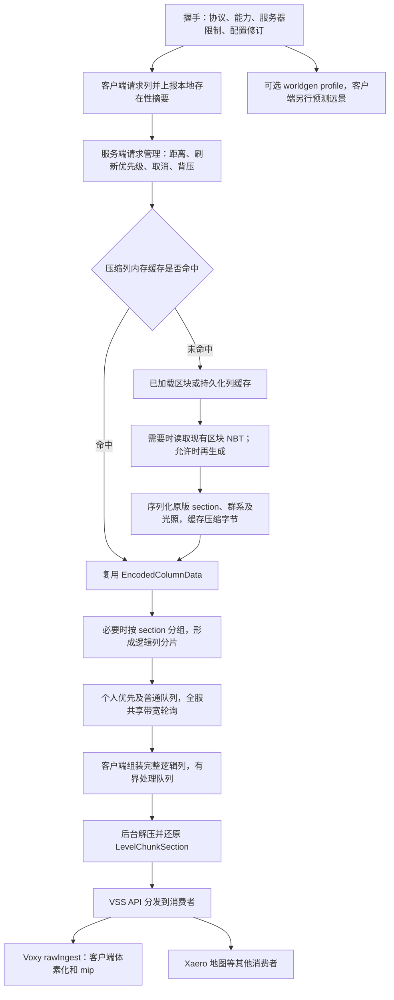

# Neo Voxy 与 Noxy 对比研究及补齐建议

> **2026-10-02 实施更新：**本轮先落实轻量目录、区域版本核验和增量请求发现。下面原始对比保留调研时的基线；当前行为以本文末尾第 10 节为准。

研究日期：2026-10-01。本文以源码为依据，重点回答服务端到客户端的管线差异、性能方案、缺失功能，以及应当先补什么。原始比较未进行两个项目的同场景运行基准。2026-10-02 的缓存目录实施与验证记录见第 10 节。

## 1. 结论先行

**最值得学习的是：缓存编码结果的复用、明确的能力协商、面向实际帧耗时的构建预算，以及把特殊模型和动态对象从地形体素中分离。我们应保留现有的距离分级传输、合批压缩和接收信用机制，在这些基础上补齐重复编码成本、已有区块直接读取和客户端性能诊断。**

首先必须区分三个项目：

| 项目 | 实际职责 | 本次如何比较 |
| --- | --- | --- |
| **Neo Voxy**，用户提供的仓库 | Voxy 渲染器分支；多版本适配、特殊模型、光影与 GPU 优化；1.21.1 有远景玩家、载具、Create 状态同步 | 比较渲染、动态同步、兼容功能与工程实践 |
| **Voxy Server Side（VSS）** | Neo Voxy README 推荐的独立配套项目；负责地形列读取、缓存、传输，以及地图和预测功能 | 用其 Forge 1.20.1 源码对比我们的地形传输管线 |
| **Noxy / voxy-distant**，当前仓库 | Voxy 附属 Mod；本地生成、服务端缓存和按距离传输 LOD；客户端管理粗细覆盖关系 | 主要比较对象；涉及渲染器能力时，同时检查我们固定使用的 Voxy Forge 分支 |

Neo Voxy README 明确说明：**其服务端可选安装不代表可以获得服务器视距之外的未知地形**。地形共享由 VSS 提供；不要把 VSS 的预测、地图桥接、缓存传输归到 Neo Voxy 本体。反过来，也不能因为 Noxy 本身没有渲染器，就说我们没有 Voxy 的基础 Hi-Z、GPU 层次遍历或光影支持。[N1]、[N2]

建议顺序：

1. **先建立端到端性能口径**，把下载、解码、写入、网格、GPU 可见和落盘分开。
2. **优先减少暖缓存重复编码**，并补“已有区块 NBT 直接读取、不生成”的前台请求路径。
3. **在配套 Voxy Forge 中补动态构建预算**，先解决移动时的帧时间尖峰。
4. 按实际整合包需求选一项特殊模型或远景对象功能，避免同时扩展全部兼容模块。
5. 静止复用、半分辨率遮挡、uniform 内存表示等先做独立实验；种子预测作为后续独立方向。

## 2. 调研基线与可信范围

| 对象 | 固定提交 | 备注 |
| --- | --- | --- |
| Neo Voxy `multiversion` | `59b103b4949434a8885cb1006687dfb56ab51648` | 默认分支；根目录主要是 1.21.1 NeoForge，另外两个客户端版本在 `editions/` |
| 配套 VSS Forge `main` | `da9725aecdc1ff99e347116afa0074b56392bccf` | 构建目标 MC 1.20.1 / Forge 47.4.20 / Java 17 |
| 当前 Noxy | `4a7da962230ffa2119b45bc37a550188b13ad860` | 当前工作区开始调研时无未提交修改，版本 `0.2.21-forge-1.20.1` |
| 我们配套的 Voxy Forge | `2294097bca526f6a629f7955afdd6d4c45b3cef0` | 当前构建读取的开发版 JAR 对应源码；基础渲染功能以此为准 |

证据分为三类：**源码已确认**的实现；**README 宣称**而未完整追踪的兼容范围；**建议验证**的收益。后两类不当作实测事实。源码链接固定到上述提交，避免默认分支后续变化导致结论失去依据。

一个具体的版本问题：VSS Forge README 写“协议 46”，但本次固定提交的 `VSSConstants.PROTOCOL_VERSION` 是 **47**，`VSSNetworking` 使用它建立严格版本匹配的通道。应以该提交源码为本次分析依据；这不等于验证了公开发行 JAR 的实际协议。若做运行对比，必须记录 JAR 哈希，不能只看 README 或模组版本号。[S1]、[S2]、[S3]

## 3. 服务端到客户端的管线

### 3.1 我们的地形管线

关键特点：[O1]、[O2]、[O3]、[O4]

- 服务端保存完整 L0～L4，但网络主要只发送所选层级；客户端只从已收到的层级继续生成更粗父层。
- 默认距离档位 `32:0,64:1,96:2`，默认最多 16 列合批。档位按兄弟组边界选择，避免相邻子区段精度关系破坏父节点细分。
- 同一个 `Key` 的在途工作可以服务多个玩家；同次工作内，同一层级的编码也会复用。**我们已存在工作合并，缺的是跨后续请求持续复用编码结果。**
- 分片头含 epoch、transfer、request ID、版本与精度；取消和旧会话结果会被筛除。
- 服务端根据客户端广告的接收信用预留在途内存；客户端处理结束发送 Receipt。它表示缓冲可释放，**不证明网格已上传 GPU，也不证明磁盘持久化完成**。
- 客户端覆盖索引控制父子细分、处理原版近景和远景覆盖；传输成功与最终显示仍是不同阶段。

### 3.2 VSS 的地形管线

关键区别：**VSS 所称 voxel column / LOD column 在这条真实数据管线里，传的是原版区块 section 的序列化数据，不是我们已经降采样后的某个 LOD 层级。**`SectionSerializer` 写出方块状态容器、群系容器和光照；客户端重新构造 `LevelChunkSection`，Voxy 桥接再调用 `rawIngest`。[S4]、[S5]、[S6]

因此它能够用同一份完整列服务多个消费者，也能按客户端渲染器决定后续处理；代价是远处真实列仍携带细节，客户端仍要承担体素化与 mip 工作。VSS 的“近、中、远请求速率”是调度速率，不等于网络发送 L1/L2 的降采样。[S7]

它的 split 是 **section 分组**，每组最多 8 个 section，目标包大小按带宽在 8～256 KiB 间选择；不是我们的压缩字节偏移分片。客户端收齐所有 parts 后才分发完整逻辑列。不能据此宣称“上方 section 先到就立即显示”。[S8]、[S9]

### 3.3 Neo Voxy 本体的动态对象管线

1. **远景玩家与载具**：客户端 Hello 订阅 → 服务端每 10 tick 筛选同维度、范围内玩家 → 每轮复用采样快照 → 批量发送位置、姿态、装备和载具信息 → 客户端显示远景对象。
2. **Create 列车**：服务端采样车厢 → `CarriageShapePayload` 发方块、材质相关 NBT、转向架形状 → `TrainPosesPayload` 周期性发送坐标与姿态 → 客户端缓存形状并插值运动。
3. **Create 动态构件**：筛出运动或刚停止的构件，仅同步姿态；其模型依赖客户端已有快照，不能理解为所有未知构件几何都能凭姿态包还原。

静态形状与动态状态的分离很值得学习：形状缓存可供所有玩家复用；列车同轮姿态按维度复用；载具模型数据没变化时不重复发送；每轮最多构建 8 个车厢形状。玩家状态默认 2 次/秒、列车默认 4 次/秒，降低网络和采样成本，平滑显示交给客户端。[N3]、[N4]、[N5]

## 4. 地形传输逐项对比

| 维度 | Neo Voxy 配套 VSS | 我们当前实现 | 判断与行动 |
| --- | --- | --- | --- |
| 网络数据内容 | 完整原版 section、群系、光照 | 指定 LOD 层级、该层需要的调色板 | 远处流量是我们的核心优势；保留 |
| 暖缓存服务 | 压缩列 LRU；持久化压缩字节可复用 | RocksDB block cache；每次有效列读取仍解压，按需求展开并重新编码 | 学习跨请求编码复用，减少 CPU 与分配 |
| 多玩家同列 | 缓存复用、磁盘/NBT/生成任务合并 | 同 Key 工作合并、同次按层编码复用 | 不是“他们有去重而我们没有”；优化应针对后续重复请求 |
| 网络压缩 | Zstd 可用且对端支持时使用，否则 Deflate / 原始数据 | 内置 Zstd；支持多列合批压缩 | 我们合批利用跨列重复；两端算法不同，不可直接比较压缩率 |
| 已有存档读取 | 前台请求可以读现有 NBT，允许时才生成 | 前台 miss 主要走完整区块 ticket；直接 Region NBT 路径主要用于后台维护 | 值得优先补，尤其生成关闭的服务器 |
| 接收背压 | 服务端队列限制、客户端 32 MiB/1024 列组装与处理限制；失败后重试 | 客户端解码内存信用、服务端预留、处理后回执；请求也看 Voxy 积压 | 我们在途内存约束更明确；VSS 字节 token 不等于接收内存信用 |
| 分片方式 | 按 section 分组并压缩；必要时解压原缓存后重分组 | 已压缩的列或合批载荷按字节分片 | 我们可严格裁切发送字节，VSS 原缓存直发优势在无需 split 时最明显 |
| 发送公平性 | 活跃玩家轮询，优先/普通队列按距离与配额选择 | 玩家轮询、字节 deficit、近处优先及周期性老化 | 都有公平调度；不能只因 VSS 有更多类就认为更优 |
| 暖启动控制消息 | 32×32 区域位图和版本摘要；可辅助服务端预加载 | 有持久化覆盖索引和快速缺口扫描，但已有列版本仍逐列请求核验 | 有大范围暖缓存实测瓶颈时再加区域摘要 |
| 服务器预加载 | 通过区域索引定位已有列；预加载单独限额 | 请求驱动，后台补缺/刷新独立调度 | VSS 的 strict Voxy 客户端会跳过主动 preload，不应照搬“登录全部推送” |
| 握手能力 | 能力位区分完整列、Zstd、预测、严格顺序 | 单一协议版本 + Hello 的世界和距离信息 | 未来加入可选功能时学习能力协商；不必现在支持所有旧版 |
| 客户端任务 | 单处理通道，优先刷新与普通队列；按列/section 限制每轮处理 | 单有序通道同时处理覆盖查询、接收写入与相关控制任务 | 保序是有用约束；是否分离解码需先测队列等待 |
| 新旧数据一致性 | request/transfer ID、时间戳、逻辑列完整性、strict ingest/mesh/GPU 跟踪 | epoch、request ID、列版本、CoverageStore、粗细分组和网格 stamp | 两边都处理一致性，但路径不同；比较最终画面与覆盖，不能只看收到多少列 |
| 缓存运维 | `.vcl` + `index.vci`，schema/header、CRC32C、容量清理 | RocksDB、原子 WriteBatch、持久化失效与后台任务 | 学习独立元数据和磁盘配额；不必改为大量小文件 |
| 未装客户端扩展 | VSS 源码通道采用严格协议匹配 | 接受扩展缺席及 vanilla，只有兼容玩家建立会话 | 我们的可选部署方式应保留；Neo Voxy 本体也使用 optional 通道 |

依据：[S2]、[S3]、[S4]、[S8]、[S9]、[S10]、[S11]、[S12]、[O1]、[O2]、[O3]、[O5]、[O6]。

### 4.1 我们确实可以补齐的不足

**A. 暖缓存仍反复做“解压 → 解析 → 调色板编码 → 合批压缩”。**

`schedule` 每次读取完整缓存并 `decodeLevels`；虽只展开目标层，但压缩帧仍整体解压、其他层仍遍历验证。`encodeAndQueue` 再做目标层调色板编码。同次在途请求已有复用，后续再次请求同列则会重复这些工作。[O2]、[O3]

最小改进候选是一个**按字节计费、版本敏感的目标层编码缓存**，键包括维度、列坐标、版本、层级和编码格式；合批时缓存该层原始编码字节。只有实测表明批压缩成本占主导，才考虑缓存压缩单列或固定批组。避免同时缓存完整对象、五层 raw、五层压缩和任意组合批次，形成不可控的内存乘数。

**B. 只查询版本也可能解压整个旧载荷。**

`LodDatabase.storedVersion` 调用 `ColumnCodec.uncompress`，只为读取 header 中一个版本值；`pack` 外层只放压缩标记和 raw 长度。可学习 VSS 把版本、schema、section 范围放在压缩体外。修改时需要明确旧缓存迁移/读取规则，不能只更新写入端。[O5]、[S11]

**C. 关闭生成不等于可以直接读取尚未缓存的已有区块。**

当前前台 `processWork` 在区块未加载、`SERVER_GENERATE=false` 时直接返回 unavailable；即使 `.mca` 中已有完整区块，也不先走 `submitSavedChunk`。该直接读取路径主要在无前台需求的后台工作中使用。VSS 的前台 NBT 路径值得借鉴，但应先复用 Minecraft 区块存储读接口，以读取服务器可见的最新存储状态，并检查数据版本、完整性与光照。[O6]、[S12]

**D. 我们对“何时可见”的常规诊断不够统一。**

已有 DebugLog 和 smoke 能统计接收、解码、写入、网格与传输指标；缺口是把这些阶段用同一会话、坐标/版本、时间基准关联成易复现的报告，尤其是 GPU 上传和首次可见的延迟。不能把 `applied`、Receipt 或覆盖索引完成都叫作“已经显示”。[O7]

**E. 资源约束覆盖到接收和索引，但没有同样清楚的服务端磁盘配额。**

`SERVER_CACHE_MIB` 控制 RocksDB 内存 block cache，不是落盘容量上限。VSS 有按总字节和条目控制的磁盘清理。可先补磁盘实际占用与人工维护入口，再决定是否做淘汰；预生成的完整远景库不应默认当成可随意丢弃的临时缓存。[O5]、[S11]

### 4.2 对方的不足与不宜照搬之处

- **完整列传输不是低精度传输。**其真实列流量和客户端 mip 成本可能比我们的远距层级载荷高；是否更快取决于带宽、暖缓存、CPU 和地形复杂度，需要实测。
- **直接复用编码缓存有条件。**客户端不支持缓存中的压缩方法，或列太大需要按 section split 时，VSS 会解压甚至重新压缩。不要把“磁盘读完直接发”写成所有请求的行为。[S8]、[S10]
- **没有与我们等价的显式接收内存信用/处理回执。**所读协议注册、session 与 sender 中，列请求在最终 part 提交时就清除；客户端仍有本地限制与重试。可学习其队列管理，但没有理由因此移除我们的信用闭环。[S3]、[S9]、[S13]
- **完整列虽然省略空气 section，仍需整列组装后消费。**不能当作分层渐进精度，也不是每个 section 到达即呈现。
- **存储方案有额外小文件开销。**每列 `.vcl` 加区域索引，百万列规模的目录访问、清理扫描与文件数量需要验证；我们的 RocksDB 更适合继续评估批量元数据和列分层布局。
- **部分错误处理过于宽泛。**例如 VSS 压缩分支 `catch (Throwable ignored)` 静默禁用 Zstd；客户端任务提交异常只重置 processing；Neo Voxy 部分联动也使用宽泛 catch。按照我们的规则，应让错误可见，只隔离可选外部边界，不复制静默回退模式。[S14]、[S5]、[N3]
- **动态通道没有统一字节带宽池。**远景玩家和列车 sampler 直接发送，各自使用距离与频率控制；大服务器需测它们与地形通道的总出口及主线程采样成本。[N3]、[N4]
- **玩家采样存在规模成本。**`FarEntityService` 对各订阅观察者遍历在线玩家，最坏接近 O(观察者数 × 玩家数)；缓存减少重复构造，不能消除距离筛选本身。大服若出现瓶颈再引入空间索引。
- **多版本并不功能对等。**1.21.1 的动态服务端通道、特殊模型 LOD、uniform 表示和实验 GPU 方案，不能直接算作 Forge 1.20.1 已提供的同等能力。

## 5. 值得学习的性能优化

### 5.1 最优先：帧耗时、任务积压共同决定构建预算

Neo Voxy 的 `VoxyRenderSystem` 用 FPS 和网格队列长度选择模型烘焙预算：FPS <40 或任务 >1000 时取较小预算；FPS <55 或任务 >400 时取中档；否则使用空闲预算。五档 render pressure 让用户决定“帧率”与“远景追赶速度”的取舍。Forge 1.20.1 分支也有对应实现。我们固定的 Voxy Forge 当前每次 `modelService.tick(900_000)` 使用固定约 0.9 ms 预算。[N6]、[O8]

学习点是**每帧主线程工作预算可随积压与性能调整**，不只是增加后台线程。实施位置在配套 Voxy Forge；Noxy 接收 duty cycle 只影响接收工作线程，不能替代渲染线程的模型预算。

建议先加入帧时间和队列诊断，再用平滑帧时间、队列长度和有滞后的恢复规则调节预算，避免瞬时 FPS 波动造成频繁振荡。成功标准同时包含帧时间 p95/p99 和新远景追赶延迟，不能只提高平均 FPS 而让地形长期追不上。

注意：源码还有 `autoBalanceSubDivSize` 方法，但本次没有找到根目录实现中的调用。**不能把方法存在写成已经开启的自动画质调节。**本项结论依据实际预算方法的调用路径。

### 5.2 编码缓存与压缩数据复用

VSS 的 `ColumnLodCache` 持有 `EncodedColumnData`，按访问顺序淘汰并限制字节和条目；预加载数据另限至缓存额度的四分之一，并统计“预加载有用命中 / 未使用淘汰”。这比只记录总命中率更能判断预加载是否浪费。[S15]

我们应学习的是**复用昂贵阶段的结果，并让 speculative 工作拥有独立预算**。最直接应用是目标层 raw 编码缓存；若未来做相邻列预读，统计预读命中与浪费，保证用户当前请求优先。现有工作合并、快缺口扫描和后台补缺都应保留。

### 5.3 uniform section：把单一体素值保留成单值表示

Neo Voxy 根目录 `WorldSection` 初始保持 `data=null` 与 `uniformValue`，需要逐体素写入时才 materialize 一个 `long[32768]`。单份数组约 **256 KiB**，空气或统一区域无需立即承担这份驻留内存。SaveLoadSystem3 的 uniform 路径维持原有序列化格式，主要节省驻留内存、展开与扫描成本，**不是把缓存文件突然缩为八字节**。[N7]

我们配套 Voxy Forge 已有固定 400 份数组的复用池，因此“增加数组池”不是新建议；值得研究的是**uniform 延迟展开、可调池上限和缩容时主动释放**。[O9]

这需要修改 Voxy 核心的所有 raw array 使用处，包括我们 `VoxyBridge.occupancy` 和 Mixin 调用。先做剖析确认空气/单值 section 占比，再完整迁移读写约定；不能只把数组设成 null。建议与网络优化分开提交和验证。

### 5.4 静止时复用绘制命令

根目录实验选项 `experimentalCmdListHold` 在视口、相机、投影、细分阈值等匹配时短期复用命令列表；默认最多 4 帧范围内复用。相机移动、FOV/投影改变、消费新的节点工作结果都要求重建。其注释指出，几何 arena 的移动或释放会使旧命令中的 `baseVertex` 失效，因此**节点结果消费必须使复用失效**。[N8]

这是很好的正确性设计经验：缓存必须由完整输入和内容修订控制。我们持续接收数据时更新频繁，实际可复用比例可能较低；暖缓存静止观察时更有潜在收益。还需检查动态物体改变深度但相机不动的场景，防止旧遮挡造成延迟或漏显。

### 5.5 原版区块遮罩复用与半分辨率

Neo Voxy 的 `ChunkBoundRenderer` 用区块集合内容 generation、相机、MVP、距离、buffer 有效标记决定遮罩是否可复用；**Iris 光影管线存在时禁用复用**，因为 TAA 抖动需要逐帧对应。半分辨率路径加入 silhouette dilation、坡度 depth offset、奇数尺寸比例修正，避免近景交接裂缝。[N9]

最值得借鉴的是对 TAA 和交接边缘的处理条件，不是单独把纹理尺寸除以二。迁移前应覆盖负坐标、斜视角、奇数分辨率、移动和光影；本项属于 Voxy Forge 渲染器实验。

### 5.6 Hi-Z 使用 shared-memory compute 合并多级 reduction

Neo Voxy `HiZBuffer2` 每次 compute dispatch 最多生成 6 层 mip，使用 64×64 tile，带必要的 barrier；构建失败时记录错误并显示提示，使用 draw-chain 路径。[N10]

我们已经有基础 Hi-Z，配套源码也存在旧 `HiZBuffer2`，但当前 Viewport 实际创建 `HiZBuffer`。所以差距是**新的 compute 实现、接入和可测的硬件兼容路径**，不是从零补遮挡剔除。[O10]

GPU 收益依赖驱动与硬件。分别测 NVIDIA、AMD、Intel，核对深度语义、透明物体、Iris reverse-Z 和状态恢复；只有某一阶段耗时实际下降且没有错剔除，才决定默认设置。

### 5.7 不透明近层先画，减少被遮挡的片元

实验选项 `experimentalOpaqueNearFirst` 反向遍历生成的 render list，让较细、通常较近的层级先提交。源码明确说这是**按层级块的启发式顺序，块内并非严格距离排序**。正确性仍由深度测试保证。[N11]

这可以降低部分 overdraw，但不能声称全场景更快，也不能用于透明绘制的排序。先看 GPU 片元耗时，再决定是否值得迁移。

### 5.8 特殊模型也采用与地形一致的屏幕空间 LOD

`NativeLodSelection` 用投影、分辨率、相机和地形区段规则选择模型层级；跨区段模型采用覆盖范围最细层。`DistantMesh` 缓存 selection revision 和位置，避免每次 draw 重算。粗化只有足够减少索引/几何时才保留，细长模型通过完整包围盒的屏幕宽高判断，降低轨道、玻璃、光束被误剔除的概率。[N12]

对我们最有用的启发有两层：

- 做 Create / LittleTiles 等兼容时，特殊几何不要脱离地形自己的尺度和交接规则。
- 网络距离档位可将来增加“望远镜/FOV 导致的局部精度需求”；但这不是现成的网络方案，必须有客户端请求、服务端限额、过渡和预算。先解决当前下载瓶颈，不立即新增任意精度请求协议。

### 5.9 快照、烘焙、上传各自有预算

根目录 LittleTiles 路径限制同时烘焙 2 个、每 tick 上传 2 个；动态构件有 GPU 内存预算与近处优先恢复。Create 服务端形状只建一次、同轮姿态只算一次、每轮限制形状构建数量。[N4]、[N13]

这适用于未来的特殊模型通道。当前 Noxy 已有快照内存、tick 时间、生成并发、发送内存和在途信用预算；应延伸同一思路到新增渲染资源，不重建一套包罗所有阶段的调度框架。

### 5.10 按需性能捕获，比常驻逐列日志更易定位卡顿

Neo Voxy `FrameProfiler` 捕获帧和各渲染阶段耗时，采样调试状态；帧超过 40 ms 时有限次抓取渲染/工作线程栈，GPU timing 只在捕获期间开启。[N14]

我们已有丰富传输日志，值得补一个短时捕获入口，把网络、解码、覆盖锁、保存、网格和 GPU 阶段放进同一报告。线程栈捕获有自身开销，应显式启动、限制时间与数量，报告中标明诊断开启状态。

### 5.11 光影简化必须与光影包的实际能力匹配

根目录 `lodLiteShading` 不只是通用 shader 开关：`IrisShaderPatch` 先检查已知包的简化 patch，否则读取光影包提供的 opaque/translucent lite 程序，校验二者契约、API 版本和交接条件，并显示生效或失败原因；标准/简化程序按一对切换。[N21]

值得学习的是**用户看到的“已开启”与渲染管线的“实际生效”分开**。如果我们增加低成本光影选项，应给出当前包是否支持和实际状态，不能声称任意 Oculus/Iris 光影都能由一个开关自动变快。这属于配套渲染器工作，先测 GPU 光影耗时再排期。

## 6. 特色功能：哪些确实是我们没有的

“我们没有”指当前 Noxy + 固定 Voxy Forge 组合未提供对应专项能力，不把另一个项目中仅出现配置字段当成已经验证的完整支持。

| 能力 | Neo Voxy / VSS 范围 | 我们现状 | 学习价值与归属 |
| --- | --- | --- | --- |
| 多游戏版本发布 | Neo Voxy 1.21.1 NeoForge、1.20.1 Forge 客户端、26.1.2 NeoForge 客户端 | Noxy 当前只发 1.20.1 Forge | 中期；先抽清实际平台接入点，保留算法和协议测试 |
| 服务器视距外的远景玩家与乘坐载具 | Neo Voxy 1.21.1 服务端通道；VSS 另有实现 | 无对应通道 | 有明确玩法需求时做独立功能；不能由地形体素代替 |
| 服务端远景 Create 列车位置与形状同步 | Neo Voxy 1.21.1；1.20.1 客户端分支更多依赖已知快照/内置服跟踪 | 无专项实现 | 较高；静态形状 + 周期姿态值得学习 |
| Create 构件、轨道、动力部件专属模型 | 1.21.1 主要实现；Forge 客户端分支有相应部分实现 | 普通体素传输不保存完整机械几何和模型数据 | 选最常用的一个 Mod；放在 Voxy Forge 兼容层 |
| Copycats、Domum、FramedBlocks、LittleTiles 精细材质/模型 | README 给出以 1.21.1 为主的版本基线，LittleTiles 标实验 | 只传 BlockState、群系、光照，不传每方块模型/BlockEntity 数据 | 高价值但维护成本高；需要独立快照存储与失效规则 |
| Sable / Aeronautics 结构 | README 有专项联动，Aeronautics 为实验范围 | 无专项支持 | 高成本；必须针对具体版本和坐标变换实机验证 |
| PowerGrid 电线与 Simulated 激光 | 1.21.1 主要联动 | 无专项细长几何通道 | 不适合仅靠粗地形体素；保留专用几何更合理 |
| 季节积雪、结冰、季节颜色 | Ecliptic Seasons 联动；体素缓存季节无关、模型阶段应用季节 | 无专项季节模型层 | 缓存语义很值得学，避免季节变化重传整世界 |
| 远景信标光束 | 1.21.1 文档列出；Forge 分支也有 DistantBeaconRenderer，但版本表未作同等承诺 | 无专项远景光束 | 可作为第一个较小的特殊几何试点 |
| 世界曲率 | 三个客户端版本 README 宣称支持 | 无该配置与专项路径 | 外观功能；优先级低于吞吐和帧时间 |
| 树叶性能/平衡/质量模式 | 三版本；FAST 可把树叶改为 solid 烘焙 | 无对应模式 | 中等；改变外观和遮挡，不能只用 FPS 验收 |
| 群系水色过渡 | 三版本 README；根目录有 blend 半径与 scope | 我们传群系信息，但没有这套平滑选项 | Voxy Forge 工作；协议已有群系基础，无需先扩网包 |
| 光影包专用 LOD 简化程序及生效状态 | 根目录 1.21.1；必须有匹配 patch 或程序契约 | 有基础光影接入，没有这套 lite 契约和状态 | GPU 光影成为瓶颈后再做；支持范围须逐包验证 |
| 圆形交接与渐变 | 1.21.1 / 26.1.2；README 标 1.20.1 未提供圆形交接 | 无 Neo Voxy 这套配置 | 画面体验；与光影自身交接避免重复处理 |
| 扩展高度坐标 | 1.21.1 根目录有带格式标记的扩展键 | Hello/codec 和 CoverageStore 有高度、section 数与键布局限制 | 确定要支持超高世界后，端到端升级键、协议、渲染与旧缓存 |
| 通用列消费者 API + Xaero 地图桥接 | **VSS**；可以只安装地图消费者而没有 Voxy | 直接接 Voxy，没有消费者 API | 需求明确时新增最小回调；粗层不应冒充精确地图数据 |
| 客户端种子驱动预测 | **VSS**；worldgen profile、Java/Rust 后端、预测缓存和真实列覆盖 | 我们本地生成用真实服务器世界，不是预测 | 长期方向；开发和兼容成本远高于其他补齐项 |
| 磁盘缓存容量淘汰 | **VSS** 完整列存储 | 只有内存额度与磁盘占用统计，没有该配额策略 | 大存档有需求时补；避免默认删除预生成成果 |

依据：[N1]、[N2]、[N3]、[N4]、[N7]、[N12]、[N15]、[N16]、[S1]、[S6]、[S16]、[O1]、[O3]、[O4]、[O5]、[O11]。

### 为什么复杂模型要独立于地形体素

我们 `LodColumn` 包含的是 BlockState、群系和体素光照/透明度，并没有 BlockEntity 模型数据、微方块几何、线缆控制点、车辆运动或季节外观。提高地形精度只能改善方块采样，不能恢复根本未传输的信息。[O4]

更合理的边界是：

- 地形继续使用现有真实 LOD 管线。
- 特殊静态模型保存可版本化的几何/材质快照，通过明确的变更事件失效。
- 动态对象把形状和姿态分开；模型可持久缓存，姿态只保留短期会话数据。
- 原版/特殊远景交接在同一帧固定归属，并等待原版重新稳定后接管。Neo Voxy 的 `LiveHandoffState` 采用 250 ms 重接管等待，这是可借鉴的具体经验。[N17]

### 预测功能的实际取舍

VSS 预测通过服务器同步世界生成信息，在客户端生成近似远景，真实列再覆盖它。README 明确说它不执行完整雕刻、装饰与结构融合，不包含玩家修改；某些地形 Mod 有特定版本适配，不代表任意整合包可用。[S1]

它主要优化**地平线首次有内容的等待时间**，不能直接当作真实地形管线的压缩收益。引入后会增加客户端 CPU、内存、预测缓存、近远交接和 Java/Rust 平台维护成本，也需要明确服务器是否愿意同步世界种子与生成配置。我们应先把真实粗 LOD 的首屏时间降下来，再评估预测是否仍有足够收益。

## 7. 工程实践中值得学习的部分

### 7.1 功能能力由当前连接决定

Neo Voxy 使用 `ServerCapabilities` 检查具体 payload 通道，设置页据此标示是否可用；不支持的连接保留用户偏好而停用服务端依赖功能。VSS 用能力位和配置 revision 同步会话限制。[N2]、[S7]

我们已支持未安装扩展的服务器和客户端，不需要重写兼容策略。等新增远景对象、地图元数据或其他可选管线时，再把可选能力与核心协议版本分开，避免一项可选功能影响基础地形接收。

### 7.2 验证真实行为和跨版本产物

Neo Voxy 有世界坐标、terrain mip、原版交接、RocksDB 生命周期、特殊模型粗化和 GPU 验证程序，多版本 CI 分别使用 Java 17/21/25。[N18]

我们已有服务器/客户端 smoke、维护导入、真实列对照和传输基准；这不是零基础。应优先把现有关键端到端验证接入可重复的 CI/本地命令，在多版本扩展时对每个 loader 单独跑握手、维度切换和最终覆盖，避免为小实现增加大量镜像式单测。[O12]

### 7.3 学习机制，但保持最小实现

VSS 的模块划分较细，便于分工，但我们没有必要为每项一次性策略新增 Manager、Coordinator、Policy 和 Runtime。先定位实际瓶颈、只改必要路径；实现后消融掉无收益的预读、多余缓存和重复状态。

Neo Voxy 当前根目录和 Forge edition 的许可证都写 **All rights reserved / Do not redistribute**；VSS 标 MIT。学习算法与行为设计可以继续，若要移植 Neo Voxy 源码，应先核实具体文件及许可，不能直接把其新增代码纳入我们 MIT 项目。本文未复制其实现代码。[N19]、[S1]

## 8. 补齐路线：按收益、成本和职责排优先级

下列目标是**候选验收标准**，不是已测收益承诺。每项单独实现、验证、消融审查、中文提交；没有证据支持的优化不进入默认路径。

| 优先级 | 工作项与最小范围 | 修改位置 | 验收要点 |
| --- | --- | --- | --- |
| **P0** | 统一现有 smoke/诊断的冷暖启动报告；新增首次真实 LOD 可见、精度补齐、网格/GPU 阶段关联 | Noxy smoke + Voxy Forge 诊断 | 能从同一批数据解释等网络、等解码、等覆盖锁、等保存还是等网格/GPU；报告含 p95/p99 |
| **P1** | 版本/schema 移出压缩体；先解决只查询版本的整列解压 | Noxy `LodDatabase` | 旧缓存读入方案明确；更新比较无需展开旧体素；脏列旧结果不能覆盖新版本 |
| **P1** | 有界目标层 raw 编码缓存；只缓存实际请求层，复用现有工作合并 | Noxy `RemoteServer` | 暖缓存重复请求编码 CPU 明显下降；预算含真实字节；版本变化立即失效；流量不明显恶化 |
| **P1** | 前台请求读取已有完整区块 NBT；未找到时按配置决定生成/不可用 | Noxy 服务端读取路径 | 生成关闭时可取得未加载但已保存的地形；不产生新区域；并发保存后不发送旧版本 |
| **P1** | 模型烘焙与根节点处理预算根据帧时间和任务积压调整 | 配套 Voxy Forge | 低帧率移动场景 p99 改善，同时追赶延迟满足要求；关闭后可直接对照 |
| **P2** | 一个专项模型功能试点，如远景信标，或用户最常用的 Create 模块 | Voxy Forge；必要时 Noxy 可选通道 | 原版交接无双绘/消失；快照失效正确；GPU、烘焙和上传均有预算 |
| **P2** | 远景玩家/载具或 Create 列车的形状与姿态通道，二选一开始 | Noxy 可选通道 + Voxy Forge 对象渲染 | 未支持服务器显示不可用；断线/维度/离开范围清理；总流量与插值延迟可解释 |
| **P2** | uniform section 和可调数组池；先确认可节省的驻留内存 | Voxy Forge 核心及 Noxy 接入 | heap/GC 降低；所有数组访问兼容；粗层、空气覆盖与保存重启一致 |
| **P2** | 有具体地图需求时增加最小消费者回调与 Xaero 试点 | Noxy 接收边界 | 消费者不会阻塞地形写入；明确精度和版本；只依赖地图时是否请求精确列有明确产品选择 |
| **P2** | 磁盘配额/维护；先统计容量并提供明确操作，再决定自动策略 | Noxy RocksDB 运维 | 失效记录与世界 ID 不误删；容量统计解释 compaction；已删列按既定策略重建 |
| **P3** | 静止命令复用、遮罩复用、半分辨率、compute Hi-Z、near-first 逐项 A/B | Voxy Forge | 每项 GPU/CPU 阶段可量化改善，移动、更新、TAA、reverse-Z 不错绘 |
| **P3** | 网络区域摘要和按层独立持久化；仅在暖缓存/解码基准证明必要时做 | Noxy 协议与存储 | 控制包和解压成本下降；不能增加一堆低命中冗余索引；旧数据升级可验证 |
| **P3** | 客户端预测、Rust 世界生成、多 loader 全面扩展 | 独立研究项/分阶段分支 | 单独功能目标、版本矩阵和资源预算；真实列始终权威覆盖 |

**建议首批只做四件事：统一基准、压缩体外元数据、目标层编码缓存、已有 NBT 前台读取。**这批直接作用于我们主要职责，几乎不扩大玩法与兼容范围。渲染预算可在 Voxy Forge 仓库并行规划，但需要独立验证和提交。

### 不建议立即做的设计

- 不切换到 VSS 完整 section 传输替代当前粗层协议；这会削弱我们已有的流量目标。
- 不为性能测试一次新增五层独立文件、十种编码副本和任意跨玩家批次缓存。
- 不因为 VSS 存在登录预加载就改为主动推送；strict Voxy 路径明确跳过它。
- 不先提高线程/并发默认值；服务器 MSPT、客户端网格队列、内存信用可能才是真正限制。
- 不把预测、动态模型、多平台迁移作为一个大提交，避免功能之间无法判断收益和回归。
- 不直接替换 mip 算法。Neo Voxy 的流体、薄表面、天空光策略有差异，但我们服务端与固定客户端的 mip 一致性是现有设计基础；要升级必须两端和缓存一起评估。[N20]、[O4]

## 9. 如何验证“补齐”确实有效

### 9.1 公平比较必须统一条件

固定同一世界存档、相同 Minecraft/loader、同一原版视距、同一 LOD 半径、硬件、JVM 参数、网络限速和客户端缓存状态。记录两边 JAR 哈希和配置。Forge 对比只使用对应 Forge 能力；1.21.1 新渲染功能另立实验，不把跨版本 FPS 当成某项算法收益。

两种传输质量也要分开比较：

1. **同等真实精度**：我们的全 L0 配置与 VSS 完整 section 数据对比，主要观察编码缓存、传输、客户端处理和最终可见延迟。
2. **各自默认体验**：我们的距离 L0/L1/L2 与 VSS 默认调度对比；同时给出远景画面质量、首屏和流量，说明这不是相同输入精度。

现有 README 的 **1,500.46 MB 缓存 / 117.93 MB 载荷 / 92.14% 减少**属于我们自己的实验，比较口径是完整 LOD 磁盘缓存与网络载荷，**不是 VSS 同场景实测值**。不能用它声称“我们比 VSS 快十二倍”或“对方会传 1.5 GB”。原版 section 的编码和压缩与完整 L0～L4 数据库也不同。[O13]

### 9.2 最少需要覆盖的场景

| 场景 | 为什么要测 | 主要指标 |
| --- | --- | --- |
| 冷客户端、暖服务端、静止 | 隔离网络与编码 | 真实载荷、控制消息、首次可见、90%/99% 目标覆盖时间 |
| 暖客户端、同世界重连 | 观察版本核验与重复下载 | 控制包数量、服务端解压次数、首次补缺延迟、重复载荷 |
| 1/4/16 玩家重叠请求 | 检验编码缓存与公平性 | 每列转换/编码次数、总出口、各玩家延迟 p95、服务端 MSPT |
| 高速移动与反向返回 | 检验取消、近处优先、缓存 | 无效传输字节、精度追赶延迟、网格队列、帧时间 p99 |
| 低带宽或高 RTT | 检验信用和过期策略 | 信用阻塞、队列驻留、客户端内存峰值、重试比例 |
| 已有 `.mca`、无 LOD 缓存、关闭生成 | 验证 NBT 新路径 | 成功真实列比例、没有新区域生成、最新版本、光照完整性 |
| 批量编辑后离开再返回 | 检验脏列与重启一致性 | 新旧版本接受次数、空列覆盖、幽灵地形、落盘后重连结果 |
| 模组群系、薄水层、树叶、超高地形 | 检验数据语义 | 群系颜色、流体、细分接缝、支持范围内坐标/高度正确性 |
| 静止但世界更新；无光影 / TAA 光影 | 验证复用优化 | GPU 阶段耗时、更新可见延迟、错剔除和交接裂缝 |

每项性能改动至少重复同一场景三次，报告中位数和范围。冷/暖缓存必须明确，诊断开关固定。服务端缓存磁盘字节、mod payload 字节、协议估算字节和 socket 实际字节分别记录；`send()` 调用也不等于数据已经穿过网卡，不能用字段名代替测量层级。

### 9.3 消融与保留标准

对每项优化单独关闭并重测。候选保留门槛可设为：所针对阶段 p95 耗时或 CPU 至少下降约 20%，总体覆盖延迟不退化超过约 5%，没有画面/版本错误，内存严格在预算内。门槛应结合实际波动调整；比噪声还小的收益不值得新增长期复杂度。

最终成功不是“下载计数更大”，而是**服务器正常工作、客户端移动平稳、正确地形更早可见、远处流量少、走近能补齐、重进世界仍然一致**。

## 10. 代码证据索引

以下链接均固定到研究提交。行号用于定位关键实现，阅读时应结合相邻调用处。`N` 表示 Neo Voxy，`S` 表示独立 VSS，`O` 表示我们的仓库或配套 Voxy Forge。

| 编号 | 证据 |
| --- | --- |
| N1 | [Neo Voxy README：职责、版本、实验选项和兼容矩阵][N1] |
| N2 | [Neo Voxy 通道注册入口][N2]；[ServerCapabilities][N2a] |
| N3 | [FarEntityService：周期采样、同轮缓存、载具内容去重][N3] |
| N4 | [CreateTrainSampler：形状/姿态缓存、范围和预算][N4] |
| N5 | [DistantTrainProtocol][N5]；[Create 服务端配置][N5a] |
| N6 | [1.21.1 模型预算选择][N6]；[Forge 1.20.1 对应实现][N6a] |
| N7 | [WorldSection：uniform 与数组池][N7]；[SaveLoadSystem3：兼容格式][N7a] |
| N8 | [AbstractRenderPipeline：命令复用条件及内容更新失效][N8] |
| N9 | [ChunkBoundRenderer：复用、TAA、半分辨率处理][N9] |
| N10 | [HiZBuffer2：shared-memory compute、barrier 与提示][N10] |
| N11 | [cmdgen.comp：near-first 的实际含义][N11] |
| N12 | [NativeLodSelection][N12]；[DistantMesh][N12a]；[DistantMeshLod][N12b] |
| N13 | [LittleTiles 烘焙/上传额度][N13]；[构件 GPU 预算][N13a] |
| N14 | [FrameProfiler：限时诊断、GPU timing 与卡顿栈][N14] |
| N15 | [VoxyConfig：画面、联动与实验参数][N15]；[Forge edition 参数][N15a] |
| N16 | [扩展高度键布局][N16]；[季节变更处理][N16a] |
| N17 | [LiveHandoffState：帧内归属及重新接管等待][N17] |
| N18 | [多版本 CI][N18]；[行为验证任务][N18a] |
| N19 | [根许可证][N19]；[Forge edition 许可证][N19a] |
| N20 | [Mipper：流体、代表子体素、天空光与薄表面][N20] |
| N21 | [IrisShaderPatch：lite 程序与契约][N21] |
| S1 | [VSS README：独立功能、预测边界、MIT 声明][S1] |
| S2 | [VSSConstants：本次提交协议值与能力位][S2] |
| S3 | [VSSNetworking：协议匹配及消息注册][S3] |
| S4 | [SectionSerializer：真实网络数据内容][S4] |
| S5 | [ClientColumnProcessor：有界单通道、解码及提交][S5] |
| S6 | [VoxyCompat：消费者注册及 rawIngest][S6]；[VSSApi][S6a] |
| S7 | [PlayerSessionManager：能力与配置同步][S7]；[列请求 handler][S7a] |
| S8 | [ColumnPayloadSplitter][S8]；[BandwidthProfile][S8a] |
| S9 | [ClientColumnTransferAssembler：完整列组装][S9] |
| S10 | [VoxelColumnS2CPayload：已有压缩字节复用条件][S10] |
| S11 | [PersistentColumnLodStore：header、CRC、区域索引及容量清理][S11] |
| S12 | [ColumnStorageReadPipeline：存档 NBT 读取与合并][S12] |
| S13 | [QueuedColumnSender：轮询、过期和提交完成][S13]；[过期等待估算][S13a] |
| S14 | [LodByteCompression：压缩算法与异常处理][S14] |
| S15 | [ColumnLodCache：编码缓存、预加载额度与命中统计][S15]；[ExistingColumnPreloader][S15a] |
| S16 | [VSS 客户端 API 消费与 strict 能力广告][S16]；[预测内存约束][S16a] |
| O1 | [当前协议与接收信用计算][O1] |
| O2 | [服务端请求、缓存读取、发送与回执][O2] |
| O3 | [ColumnCodec：按层编码、解压及跳过展开][O3] |
| O4 | [LodColumn：体素内容与 reduce][O4]；[CoarseLodReceiver][O4a] |
| O5 | [LodDatabase：RocksDB、版本读取与压缩体包装][O5] |
| O6 | [服务端直接存档读取与前台工作][O6] |
| O7 | [DebugLog：阶段指标与 Receipt 语义][O7] |
| O8 | [配套 Voxy Forge：固定模型烘焙预算][O8] |
| O9 | [配套 Voxy Forge：既有数组池及 dense 表示][O9] |
| O10 | [配套 Voxy Forge：当前 Viewport 采用 draw-chain Hi-Z][O10] |
| O11 | [CoverageStore：覆盖、页预算、键布局与细分约束][O11] |
| O12 | [现有 smoke 源码目录][O12] |
| O13 | [我们 README 的实验条件与数据口径][O13] |

[N1]: https://github.com/NHblock-Johnsnow/neo-voxy-multiversion/blob/59b103b4949434a8885cb1006687dfb56ab51648/README.md
[N2]: https://github.com/NHblock-Johnsnow/neo-voxy-multiversion/blob/59b103b4949434a8885cb1006687dfb56ab51648/src/main/java/me/cortex/voxy/Voxy.java#L160
[N2a]: https://github.com/NHblock-Johnsnow/neo-voxy-multiversion/blob/59b103b4949434a8885cb1006687dfb56ab51648/src/main/java/me/cortex/voxy/client/ServerCapabilities.java#L11
[N3]: https://github.com/NHblock-Johnsnow/neo-voxy-multiversion/blob/59b103b4949434a8885cb1006687dfb56ab51648/src/main/java/me/cortex/voxy/compat/far/FarEntityService.java#L33
[N4]: https://github.com/NHblock-Johnsnow/neo-voxy-multiversion/blob/59b103b4949434a8885cb1006687dfb56ab51648/src/main/java/me/cortex/voxy/commonImpl/compat/create/CreateTrainSampler.java#L249
[N5]: https://github.com/NHblock-Johnsnow/neo-voxy-multiversion/blob/59b103b4949434a8885cb1006687dfb56ab51648/src/main/java/me/cortex/voxy/commonImpl/compat/create/DistantTrainProtocol.java#L44
[N5a]: https://github.com/NHblock-Johnsnow/neo-voxy-multiversion/blob/59b103b4949434a8885cb1006687dfb56ab51648/src/main/java/me/cortex/voxy/commonImpl/compat/create/CreateServerConfig.java#L14
[N6]: https://github.com/NHblock-Johnsnow/neo-voxy-multiversion/blob/59b103b4949434a8885cb1006687dfb56ab51648/src/main/java/me/cortex/voxy/client/core/VoxyRenderSystem.java#L528
[N6a]: https://github.com/NHblock-Johnsnow/neo-voxy-multiversion/blob/59b103b4949434a8885cb1006687dfb56ab51648/editions/forge-1.20.1-client/src/main/java/me/cortex/voxy/client/core/VoxyRenderSystem.java#L403
[N7]: https://github.com/NHblock-Johnsnow/neo-voxy-multiversion/blob/59b103b4949434a8885cb1006687dfb56ab51648/src/main/java/me/cortex/voxy/common/world/WorldSection.java#L41
[N7a]: https://github.com/NHblock-Johnsnow/neo-voxy-multiversion/blob/59b103b4949434a8885cb1006687dfb56ab51648/src/main/java/me/cortex/voxy/common/world/SaveLoadSystem3.java#L37
[N8]: https://github.com/NHblock-Johnsnow/neo-voxy-multiversion/blob/59b103b4949434a8885cb1006687dfb56ab51648/src/main/java/me/cortex/voxy/client/core/AbstractRenderPipeline.java#L294
[N9]: https://github.com/NHblock-Johnsnow/neo-voxy-multiversion/blob/59b103b4949434a8885cb1006687dfb56ab51648/src/main/java/me/cortex/voxy/client/core/rendering/ChunkBoundRenderer.java#L186
[N10]: https://github.com/NHblock-Johnsnow/neo-voxy-multiversion/blob/59b103b4949434a8885cb1006687dfb56ab51648/src/main/java/me/cortex/voxy/client/core/rendering/util/HiZBuffer2.java#L27
[N11]: https://github.com/NHblock-Johnsnow/neo-voxy-multiversion/blob/59b103b4949434a8885cb1006687dfb56ab51648/src/main/resources/assets/voxy/shaders/lod/gl46/cmdgen.comp#L48
[N12]: https://github.com/NHblock-Johnsnow/neo-voxy-multiversion/blob/59b103b4949434a8885cb1006687dfb56ab51648/src/main/java/me/cortex/voxy/client/core/rendering/NativeLodSelection.java#L24
[N12a]: https://github.com/NHblock-Johnsnow/neo-voxy-multiversion/blob/59b103b4949434a8885cb1006687dfb56ab51648/src/main/java/me/cortex/voxy/client/compat/create/DistantMesh.java#L172
[N12b]: https://github.com/NHblock-Johnsnow/neo-voxy-multiversion/blob/59b103b4949434a8885cb1006687dfb56ab51648/src/main/java/me/cortex/voxy/client/compat/create/DistantMeshLod.java#L27
[N13]: https://github.com/NHblock-Johnsnow/neo-voxy-multiversion/blob/59b103b4949434a8885cb1006687dfb56ab51648/src/main/java/me/cortex/voxy/client/compat/littletiles/LittleTilesDistantRenderer.java#L64
[N13a]: https://github.com/NHblock-Johnsnow/neo-voxy-multiversion/blob/59b103b4949434a8885cb1006687dfb56ab51648/src/main/java/me/cortex/voxy/client/compat/create/DistantContraptionManager.java#L561
[N14]: https://github.com/NHblock-Johnsnow/neo-voxy-multiversion/blob/59b103b4949434a8885cb1006687dfb56ab51648/src/main/java/me/cortex/voxy/client/FrameProfiler.java#L15
[N15]: https://github.com/NHblock-Johnsnow/neo-voxy-multiversion/blob/59b103b4949434a8885cb1006687dfb56ab51648/src/main/java/me/cortex/voxy/client/config/VoxyConfig.java#L53
[N15a]: https://github.com/NHblock-Johnsnow/neo-voxy-multiversion/blob/59b103b4949434a8885cb1006687dfb56ab51648/editions/forge-1.20.1-client/src/main/java/me/cortex/voxy/client/config/VoxyConfig.java#L46
[N16]: https://github.com/NHblock-Johnsnow/neo-voxy-multiversion/blob/59b103b4949434a8885cb1006687dfb56ab51648/src/main/java/me/cortex/voxy/common/world/WorldEngine.java#L115
[N16a]: https://github.com/NHblock-Johnsnow/neo-voxy-multiversion/blob/59b103b4949434a8885cb1006687dfb56ab51648/src/main/java/me/cortex/voxy/client/core/compat/eclipticseasons/VoxyEsHandler.java#L13
[N17]: https://github.com/NHblock-Johnsnow/neo-voxy-multiversion/blob/59b103b4949434a8885cb1006687dfb56ab51648/src/main/java/me/cortex/voxy/client/compat/LiveHandoffState.java#L3
[N18]: https://github.com/NHblock-Johnsnow/neo-voxy-multiversion/blob/59b103b4949434a8885cb1006687dfb56ab51648/.github/workflows/build-multiversion.yml#L19
[N18a]: https://github.com/NHblock-Johnsnow/neo-voxy-multiversion/blob/59b103b4949434a8885cb1006687dfb56ab51648/build.gradle#L346
[N19]: https://github.com/NHblock-Johnsnow/neo-voxy-multiversion/blob/59b103b4949434a8885cb1006687dfb56ab51648/LICENSE.md
[N19a]: https://github.com/NHblock-Johnsnow/neo-voxy-multiversion/blob/59b103b4949434a8885cb1006687dfb56ab51648/editions/forge-1.20.1-client/LICENSE.md
[N20]: https://github.com/NHblock-Johnsnow/neo-voxy-multiversion/blob/59b103b4949434a8885cb1006687dfb56ab51648/src/main/java/me/cortex/voxy/common/world/other/Mipper.java#L117
[N21]: https://github.com/NHblock-Johnsnow/neo-voxy-multiversion/blob/59b103b4949434a8885cb1006687dfb56ab51648/src/main/java/me/cortex/voxy/client/iris/IrisShaderPatch.java#L401
[S1]: https://github.com/wish131400/voxy-server-side-forge/blob/da9725aecdc1ff99e347116afa0074b56392bccf/README.md
[S2]: https://github.com/wish131400/voxy-server-side-forge/blob/da9725aecdc1ff99e347116afa0074b56392bccf/src/main/java/dev/xantha/vss/common/VSSConstants.java#L7
[S3]: https://github.com/wish131400/voxy-server-side-forge/blob/da9725aecdc1ff99e347116afa0074b56392bccf/src/main/java/dev/xantha/vss/networking/VSSNetworking.java#L33
[S4]: https://github.com/wish131400/voxy-server-side-forge/blob/da9725aecdc1ff99e347116afa0074b56392bccf/src/main/java/dev/xantha/vss/networking/server/storage/SectionSerializer.java#L45
[S5]: https://github.com/wish131400/voxy-server-side-forge/blob/da9725aecdc1ff99e347116afa0074b56392bccf/src/main/java/dev/xantha/vss/networking/client/ClientColumnProcessor.java#L32
[S6]: https://github.com/wish131400/voxy-server-side-forge/blob/da9725aecdc1ff99e347116afa0074b56392bccf/src/main/java/dev/xantha/vss/compat/VoxyCompat.java#L57
[S6a]: https://github.com/wish131400/voxy-server-side-forge/blob/da9725aecdc1ff99e347116afa0074b56392bccf/src/main/java/dev/xantha/vss/api/VSSApi.java#L11
[S7]: https://github.com/wish131400/voxy-server-side-forge/blob/da9725aecdc1ff99e347116afa0074b56392bccf/src/main/java/dev/xantha/vss/networking/server/session/PlayerSessionManager.java#L123
[S7a]: https://github.com/wish131400/voxy-server-side-forge/blob/da9725aecdc1ff99e347116afa0074b56392bccf/src/main/java/dev/xantha/vss/networking/server/request/ColumnRequestBatchHandler.java#L68
[S8]: https://github.com/wish131400/voxy-server-side-forge/blob/da9725aecdc1ff99e347116afa0074b56392bccf/src/main/java/dev/xantha/vss/networking/server/sending/ColumnPayloadSplitter.java#L20
[S8a]: https://github.com/wish131400/voxy-server-side-forge/blob/da9725aecdc1ff99e347116afa0074b56392bccf/src/main/java/dev/xantha/vss/common/BandwidthProfile.java#L9
[S9]: https://github.com/wish131400/voxy-server-side-forge/blob/da9725aecdc1ff99e347116afa0074b56392bccf/src/main/java/dev/xantha/vss/networking/client/ClientColumnTransferAssembler.java#L26
[S10]: https://github.com/wish131400/voxy-server-side-forge/blob/da9725aecdc1ff99e347116afa0074b56392bccf/src/main/java/dev/xantha/vss/networking/payloads/VoxelColumnS2CPayload.java#L393
[S11]: https://github.com/wish131400/voxy-server-side-forge/blob/da9725aecdc1ff99e347116afa0074b56392bccf/src/main/java/dev/xantha/vss/networking/server/storage/PersistentColumnLodStore.java#L28
[S12]: https://github.com/wish131400/voxy-server-side-forge/blob/da9725aecdc1ff99e347116afa0074b56392bccf/src/main/java/dev/xantha/vss/networking/server/request/ColumnStorageReadPipeline.java#L268
[S13]: https://github.com/wish131400/voxy-server-side-forge/blob/da9725aecdc1ff99e347116afa0074b56392bccf/src/main/java/dev/xantha/vss/networking/server/sending/QueuedColumnSender.java#L54
[S13a]: https://github.com/wish131400/voxy-server-side-forge/blob/da9725aecdc1ff99e347116afa0074b56392bccf/src/main/java/dev/xantha/vss/networking/server/sending/QueuedPayloadExpiryPolicy.java#L11
[S14]: https://github.com/wish131400/voxy-server-side-forge/blob/da9725aecdc1ff99e347116afa0074b56392bccf/src/main/java/dev/xantha/vss/common/processing/LodByteCompression.java#L56
[S15]: https://github.com/wish131400/voxy-server-side-forge/blob/da9725aecdc1ff99e347116afa0074b56392bccf/src/main/java/dev/xantha/vss/networking/server/storage/ColumnLodCache.java#L11
[S15a]: https://github.com/wish131400/voxy-server-side-forge/blob/da9725aecdc1ff99e347116afa0074b56392bccf/src/main/java/dev/xantha/vss/networking/server/preload/ExistingColumnPreloader.java#L53
[S16]: https://github.com/wish131400/voxy-server-side-forge/blob/da9725aecdc1ff99e347116afa0074b56392bccf/src/main/java/dev/xantha/vss/networking/client/VSSClientNetworking.java#L322
[S16a]: https://github.com/wish131400/voxy-server-side-forge/blob/da9725aecdc1ff99e347116afa0074b56392bccf/src/main/java/dev/xantha/vss/client/prediction/PredictionMemoryBudget.java#L51
[O1]: https://github.com/KNaiFen/noxy/blob/4a7da962230ffa2119b45bc37a550188b13ad860/src/main/java/dev/voxydistant/network/Protocol.java#L17
[O2]: https://github.com/KNaiFen/noxy/blob/4a7da962230ffa2119b45bc37a550188b13ad860/src/main/java/dev/voxydistant/server/RemoteServer.java#L600
[O3]: https://github.com/KNaiFen/noxy/blob/4a7da962230ffa2119b45bc37a550188b13ad860/src/main/java/dev/voxydistant/data/ColumnCodec.java#L30
[O4]: https://github.com/KNaiFen/noxy/blob/4a7da962230ffa2119b45bc37a550188b13ad860/src/main/java/dev/voxydistant/data/LodColumn.java#L6
[O4a]: https://github.com/KNaiFen/noxy/blob/4a7da962230ffa2119b45bc37a550188b13ad860/src/main/java/dev/voxydistant/compat/CoarseLodReceiver.java#L60
[O5]: https://github.com/KNaiFen/noxy/blob/4a7da962230ffa2119b45bc37a550188b13ad860/src/main/java/dev/voxydistant/data/LodDatabase.java#L135
[O6]: https://github.com/KNaiFen/noxy/blob/4a7da962230ffa2119b45bc37a550188b13ad860/src/main/java/dev/voxydistant/server/RemoteServer.java#L718
[O7]: https://github.com/KNaiFen/noxy/blob/4a7da962230ffa2119b45bc37a550188b13ad860/src/main/java/dev/voxydistant/DebugLog.java#L15
[O8]: https://github.com/KNaiFen/voxy-forge-1.20.1/blob/2294097bca526f6a629f7955afdd6d4c45b3cef0/src/main/java/me/cortex/voxy/client/core/VoxyRenderSystem.java#L314
[O9]: https://github.com/KNaiFen/voxy-forge-1.20.1/blob/2294097bca526f6a629f7955afdd6d4c45b3cef0/src/main/java/me/cortex/voxy/common/world/WorldSection.java#L38
[O10]: https://github.com/KNaiFen/voxy-forge-1.20.1/blob/2294097bca526f6a629f7955afdd6d4c45b3cef0/src/main/java/me/cortex/voxy/client/core/rendering/Viewport.java#L45
[O11]: https://github.com/KNaiFen/noxy/blob/4a7da962230ffa2119b45bc37a550188b13ad860/src/main/java/dev/voxydistant/compat/CoverageStore.java#L12
[O12]: https://github.com/KNaiFen/noxy/tree/4a7da962230ffa2119b45bc37a550188b13ad860/src/smoke/java/dev/voxydistant/smoke
[O13]: https://github.com/KNaiFen/noxy/blob/4a7da962230ffa2119b45bc37a550188b13ad860/README.md#L9

## 10. 2026-10-02：缓存目录与请求发现第一阶段

### 10.1 本次核实的问题

客户端原来已有独立 RocksDB 覆盖索引，但请求发现逐列遍历整个高度范围；首次加载详细页还要重建渲染细分计数。跨一个区块会重建两套全圆游标。静止且扫描完成后并非无条件永远重扫。服务端启动原来遍历全部缓存列的键来计数，计数结束才开放 Hello；并没有启动时解压全部地形。设置页的全库统计是另一个按需路径。

可以把新目录理解为一本薄清单：每个区域写“有哪些列、版本是多少、精度够不够”。找下载任务先翻清单，显示和修改地形才访问详细覆盖页。

### 10.2 已实施的最小范围

- 服务端现有 RocksDB 新增区域顺序的列元数据，地形正文、缓存版本、失效版本、层级和数量原子维护。相同版本的无需更新回复只读元数据。维护导入保存快照并保留更晚的 Dirty，旧快照不会因此冒充最新地形。
- 启动及重开不再全库计数。旧库列数为未知时，设置页显示“列数统计中”；按需每批 1024 个键，进度可恢复。扫描游标之前的并发新增列与计数同步记账。
- 旧服务端区域每批最多 64 列补索引，读取 Zstd 流的固定头部，不展开体素。区域完成标记与迁移进度持久化；新写入优先。完成后的区域用连续索引范围读取。
- 客户端每个垂直覆盖页保存 1024 列的目录，跨高度页合并。版本混合、缺失、待刷新和 unsafe 页都不满足请求条件；空气仍有真实版本与精度。目录和已保存覆盖页、清除 guard 同批写入，保留既有保存确认约束。
- 客户端旧页先检查键是否存在，确认空区域立即发现缺口；有旧记录的区域延后分批解析，每次至多构建一个垂直页，不创建渲染 Page 或重建计数。继续使用单条有序工作通道，每 tick 一次约 2 ms 目录任务预算；单次磁盘读取和一个旧页解析不能被这个软预算中途抢占。
- 协议升级至 **16**，区域摘要正文为 **9236 字节**，客户端 `client.regionQueryWindow` 控制查询在途数量，默认 4，可设 1～32，设置页“服务端接收 → 区域查询窗口”可调整。服务端最多接纳 32 个，纳入已有带宽、发送内存和工作限制；调低窗口时等待已有查询完成，不取消已发查询。Dirty 在异步读取期间及发送前均叠加，防止旧摘要覆盖后来更新。
- 用区域位图替换两套全圆扫描。移动重新计算范围与精度边界，完整内部区域使用整体掩码；内部无变化不再逐列复查。近处/精度补齐与远处缺口按 3∶1 分配候选，空队列可借用。原来的重试、取消、合批和接收信用继续使用。
- 退役 `scanColumnsPerTick`、`fastScanColumnsPerBatch`、`fastScanCandidatesPerBatch` 三个远景接收选项，区域查询窗口配置加入后版本升至 6，升级前保留备份。本地生成的扫描选项不受影响。

### 10.3 验证与测量口径

192/256 暖缓存测试使用真实 CoverageStore 数据库：已有 115781 列，缺口 90080 列。目录发现加载 226 个水平区域，**渲染覆盖页为 0**；缺口数量与原快扫描一致。

| 一次同场景运行 | 原快扫描首次外圈耗时 | 新目录完成发现耗时 | 比例 |
| --- | ---: | ---: | ---: |
| 2026-10-02 | 294.3 ms | 46.8 ms | 15.9% |

这是索引基准的墙钟耗时，包含读取和解析；不是总进服时间，也不能据此声称总 CPU 降低 84%。不同运行约为 45～47 ms 对 271～294 ms。测试验证目录不加载详细页、版本混合和部分覆盖、负坐标与跨高度、unsafe 重启、旧页迁移、3∶1 名额、移动精度掩码与原规则一致、旧会话丢弃和 stale 需求不被移动抹除。

端到端结果：真实客户端请求完成检查通过；半径 24 冷缓存下载中跨一个区块验证通过，补齐约 11.3 秒，随后静止目录计数保持不变；已有半径 24 缓存扩至 32 的完整覆盖验证通过，补齐约 24.5 秒。独立服务端 smoke 包含生成/缓存、Dirty、区域摘要、带宽与信用、配置迁移、导入覆盖、多维度、故障注入、reload 和停止清理，全部通过。故障注入中的只读数据库和临时文件访问失败是预期验证日志。

半径 24 的一次暖重连覆盖审计曾发现原版近景 `(2,2)` 在光照重摄入期间尚未完整；该次未记为通过。随后半径 32 场景完整覆盖通过。渲染、原版光照与保存仍有真实工作，不把目录完成等同于所有体素已完整、网格已上传。

半径 32 的传送出去 56 区块再返回验证也通过完整覆盖审计。抓取该场景 180 秒客户端 JFR，共 4582 个执行采样：网格准备 800 个、保存序列化 732 个，另有网格扫描及体素写入；RegionDiscovery.poll 只出现 2 个采样。详细覆盖页仍会由网格加载和真正写入访问。该采样说明优化后的主要负载转向实际地形处理，没有旧实现同一时段 JFR，不能据此计算总 CPU 降幅。记录位于本机 `build/benchmarks/region-travel-client.jfr` 与 `region-travel-server.jfr`。

### 10.4 消融与升级

删除旧双扫描状态和重复覆盖查询；没有新增常驻扫描线程、第二数据库、目标层编码缓存或预读框架。目录内存纳入索引额度；未加载区域不会制造大块空覆盖页。

两端必须一起使用协议 16 的构建。缓存正文无需清理或重下载；旧索引按访问迁移。当前仅完成请求发现与缓存核验优化，模型烘焙预算、编码结果缓存、NBT 前台读取和 GPU 项目仍按原路线另批验证。

### 10.5 移动与短暂经过的处理

客户端每 tick 读取玩家所在区块；位置变化时检查当前圆形范围涉及的区域。完整且同精度的内部区域整体计算掩码，范围和精度交界区域逐列计算；掩码不变的区域不重新比较目录。新范围缺口和走近后的精度不足进入待办，没有按飞行方向预取，也不记录路径后补齐所有短暂经过的地方。

离开范围的区域待办被移除，已保存 LOD 保留。地形请求已发出时，服务端在处理和发送阶段检查当前范围；客户端还会用较近的新请求抢占尚未开始接收的远请求。已经完整到达、排队应用的数据在普通移动后仍可能应用并缓存。区域查询没有取消消息，离开范围的查询会占名额直到回复或 30 秒超时，晚到结果不应用到已移除区域。单 tick 任一轴移动超过 32 区块按传送重置 epoch，旧查询与下载结果失效。

窗口配置验证：`./gradlew test build writeSmokeLaunch` 通过；独立服务端诊断 smoke 验证配置范围 1～32、同时接纳 32 个查询并完成、拒绝第 33 个、摘要传输额度以及配置迁移至版本 6，全部通过。提高窗口主要增加已有缓存版本核验的并发，不提高本地目录任务预算或实际地形下载上限；超过默认 4 时服务端也需使用支持 32 的本次构建。
